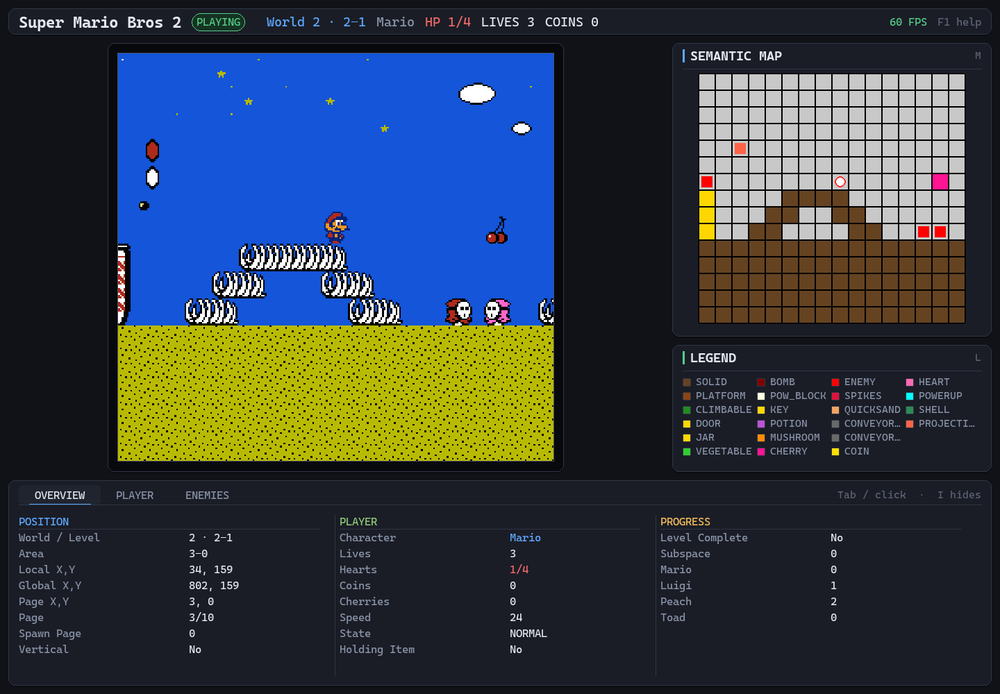

# smb2-gym

[](https://pypi.org/project/smb2-gym/)
[](https://pypi.org/project/smb2-gym/)
[](https://opensource.org/licenses/MIT)

A Gymnasium environment for Super Mario Bros 2 (Europe/Doki Doki Panic version) using TetaNES emulator Python bindings. Perfect for reinforcement learning experiments and research.

**Features:**
- Curated action sets for faster training (`simple`, `complex`)
- Comprehensive game state via info dict (50+ properties) and a semantic tile map
- Multiple initialisation modes (character/level, custom ROMs, save states)
- Human-playable interface with keyboard controls
- Up to 350+ and 750+ FPS rendered and non-rendered respectively



## Installation

```bash
pip install smb2-gym
```

## Quick Start

### Basic Usage

```python
from smb2_gym import SuperMarioBros2Env
from smb2_gym.app import InitConfig

# Create environment with character/level mode
config = InitConfig(level="1-1", character="luigi")
env = SuperMarioBros2Env(
    init_config=config,
    render_mode="human",     # "human" or None
    action_type="simple"     # "simple" (12), "complex" (16), or "all" (256)
)

# Reset environment
obs, info = env.reset()

# Run game loop
for _ in range(1000):
    action = env.action_space.sample()
    obs, reward, terminated, truncated, info = env.step(action)

    # Access game state from info dict
    print(f"Lives: {info['pc'].lives}, Hearts: {info['pc'].hearts}")
    print(f"Position: ({info['pos'].x_global}, {info['pos'].y_global})")

    if terminated or truncated:
        obs, info = env.reset()

env.close()
```

### Initialisation Modes

```python
from smb2_gym.app import InitConfig

# 1. Character/Level mode (default)
config = InitConfig(level="1-1", character="peach")

# 2. Built-in ROM variant mode
config = InitConfig(rom="prg0", save_state="level_1_1.sav")

# 3. Custom ROM mode
config = InitConfig(
    rom_path="/path/to/your/smb2.nes",
    save_state_path="/path/to/save.sav"  # Optional
)
```

### Info Dict Structure

The `info` dict uses accessor objects for organized access to game state:

```python
# Player Character state
info['pc'].lives
info['pc'].hearts
info['pc'].cherries
info['pc'].character   # 0=Mario, 1=Luigi, 2=Peach, 3=Toad
info['pc'].speed       # Horizontal velocity (signed: +right, -left)
info['pc'].y_velocity  # Vertical velocity (signed: -up, +falling)

# Position
info['pos'].x_global
info['pos'].y_global
info['pos'].x_local
info['pos'].y_local

# Game state
info['game'].world
info['game'].level
info['game'].is_game_over

# Enemies/Objects/Projectiles (all sprites: enemies, items, projectiles, doors, etc.)
for enemy in info['enemies']:
    if enemy.is_visible:
        enemy.object_type   # EnemyId enum (SHYGUY_RED, BULLET, HEART, MUSHROOM, etc.)
        enemy.global_x
        enemy.global_y
        enemy.health
        enemy.x_velocity
        enemy.y_velocity

# Semantic tile map (15x16 structured array)
info['semantic']
```

### Semantic Tile Map

The environment provides a semantic tile map representing the game world around the player as a structured 15x16 numpy array:

```python
semantic_map = info['semantic']

# Access tile information
for row in range(15):
    for col in range(16):
        tile = semantic_map[row, col]

        tile_id = tile['tile_id']        # Raw BackgroundTile ID
        fine_type = tile['fine_type']    # Fine-grained FineTileType (SOLID, CLIMBABLE, etc.)
        coarse_type = tile['coarse_type'] # Coarse-grained CoarseTileType (TERRAIN, HAZARD, etc.)

        # RGB colour for visualisation
        r, g, b = tile['color_r'], tile['color_g'], tile['color_b']
```

The semantic map provides a structured representation of the visible game world, useful for pathfinding, collision avoidance, and spatial reasoning in RL agents.

#### Terrain and sprite objects are separate layers

A cell can hold both terrain and a dynamic object — a subspace door standing on
solid ground — so they occupy different fields. Sprites never overwrite the
terrain beneath them, which is what distinguishes standing *on* a door from being
*inside* it:

```python
from smb2_gym.constants import NO_OBJECT, CoarseTileType, FineTileType

cell = semantic_map[row, col]

cell['fine_type']          # the TERRAIN here (SOLID, PLATFORM, ...)
cell['object_id']          # EnemyId of the sprite here, or NO_OBJECT (0xFF)
cell['object_fine_type']   # that sprite's type (DOOR, ENEMY, COIN, ...)

# Solid ground with something standing on it
standing_on = (semantic_map['coarse_type'] == CoarseTileType.TERRAIN) & \
              (semantic_map['object_id'] != NO_OBJECT)
```

Objects are classified by type rather than lumped together: a subspace door reads
as `DOOR`/`INTERACTIVE`, a coin as `COIN`/`COLLECTIBLE`, and only genuinely
hostile objects as `ENEMY`. The same object classifies identically whether it came
from the background tile map or a sprite slot — a POW block is `POW_BLOCK` either
way. Unrecognised object ids fall back to `ENEMY`, since treating an unknown
hazard as harmless is the more dangerous mistake.

Object footprints are measured from the sprites actually being drawn, so oversized
objects (a 1×3 Hawkmouth, a 1×2 Birdo) fill all the cells they occupy.

#### Tensor view (for ML)

`info['semantic_tensor']` is the same data as a binary `(15, 16, 16)` `uint8`
array, suitable for feeding a conv net directly:

```python
tensor = info['semantic_tensor']     # (H, W, C) uint8, values in {0, 1}
velocity = info['semantic_velocity'] # (H, W, 2) float32, normalised ~[-1, 1]

from smb2_gym.constants import COARSE_TENSOR_CHANNEL_NAMES
COARSE_TENSOR_CHANNEL_NAMES  # ('terrain:EMPTY', ..., 'object:DAMAGES', 'object:LIFTABLE')
```

Channels are binary masks rather than category ids — ids are nominal labels, and
feeding them as numbers would imply `ENEMY` (15) is "more" than `SOLID` (1).
Each coarse category appears twice, once per layer (14 channels). Within a layer
the encoding is one-hot (exactly one terrain channel is always set); across layers
it is multi-hot, so a door on solid ground sets both `terrain:TERRAIN` and
`object:INTERACTIVE`.

Two property channels follow: `object:DAMAGES` (touching this hurts) and
`object:LIFTABLE` (can be picked up and thrown). These describe what happens on
contact, which is the decision an agent actually makes about a sprite.

**Velocity** is returned separately as float32, so the tensor stays a pure binary
mask. Without it the map is a still frame — an agent cannot tell an enemy closing
on it from one moving away. Positive X is rightward, positive Y is downward
(matching row order). Concatenate if you want a single input array:

```python
combined = np.concatenate([tensor.astype(np.float32), velocity], axis=-1)  # (15, 16, 18)
```

PyTorch users want `tensor.transpose(2, 0, 1)` for `(C, H, W)`.

Other per-object state — `direction`, `health`, `object_timer`, raw `sprite_flags`
— stays in `info['enemies']` rather than becoming channels: it is useful for
reward shaping and debugging, but mostly-constant channels cost input
dimensionality without teaching a policy anything. Per-object `collision` is a
runtime *result* (it reports what just happened, and is almost always zero), so it
suits reward shaping rather than observation.

**Note:** There is a plan to extend the semantic map or create a separate `collision_map` which has the collision properties for more detailed physical interaction information.

### Example Custom Reward Function

```python
from smb2_gym import SuperMarioBros2Env
from smb2_gym.app import InitConfig

class CustomSMB2Env(SuperMarioBros2Env):
    def step(self, action):
        obs, reward, terminated, truncated, info = super().step(action)

        # Custom reward based on x-position progress
        reward = info['pos'].x_global / 100.0

        # Bonus for collecting cherries
        reward += info['pc'].cherries * 10

        # Bonus for hearts
        reward += info['pc'].hearts * 5

        # Penalty for losing a life
        if info.get('life_lost'):
            reward -= 100

        return obs, reward, terminated, truncated, info

config = InitConfig(level="1-1", character="luigi")
env = CustomSMB2Env(init_config=config, action_type="simple")
```

## Play as Human

The package includes a human-playable interface with multiple initialisation modes:

### Character/Level Mode (Default)
```bash
smb2-play --level 1-1 --char luigi --scale 3

smb2-play --level 2-3 --char peach 
```

### Built-in ROM Variant Mode
```bash
# Use specific ROM variant with save state
smb2-play --rom prg0_edited --save-state /path/to/save.sav
```

### Custom ROM Mode  
```bash
# Use your own ROM file
smb2-play --custom-rom /path/to/smb2.nes

# Use custom ROM with save state
smb2-play --custom-rom /path/to/smb2.nes --custom-state /path/to/save.sav

# Start from beginning without save state
smb2-play --custom-rom /path/to/smb2.nes --no-save-state
```

### Controls

**Primary Controls:**
- Arrow Keys: Move
- Z: A button (Jump)
- X: B button (Pick up/Throw)
- Enter: Start
- Right Shift: Select
- P: Pause
- R: Reset
- ESC: Quit

**Save States:**
- F5: Save state
- F9: Load state

### CLI Options

**Character/Level Mode:**
- `--level`: Level to play (1-1 through 7-2, default: 1-1)
- `--char`: Character (mario, luigi, peach, toad, default: luigi)

**Built-in ROM Mode:**
- `--rom`: ROM variant (prg0, prg0_edited)
- `--save-state`: Save state filename

**Custom ROM Mode:**
- `--custom-rom`: Path to custom ROM file
- `--custom-state`: Path to custom save state (optional)
- `--no-save-state`: Start from beginning without loading save state

**Display:**
- `--scale`: Display scale factor (1-4, default: 3)

## Disclaimer

This project is for educational and research purposes only. Users must provide their own legally obtained ROM files.

## Acknowledgements

This project builds upon invaluable reverse-engineering work from the SMB2 community:

- **[Xkeeper's SMB2 Disassembly](https://xkeeper0.github.io/smb2/)** - Comprehensive disassembly and documentation of Super Mario Bros 2's code and mechanics
- **[Data Crystal SMB2 RAM Map](https://datacrystal.tcrf.net/wiki/Super_Mario_Bros._2_(NES)/RAM_map)** - Detailed RAM address mappings and game state documentation

These resources were essential for understanding the game's internals and implementing the state tracking features in this library.
